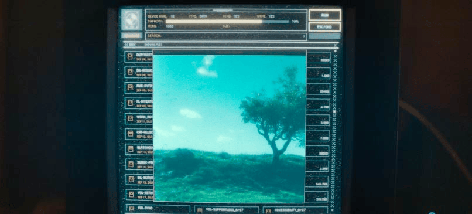
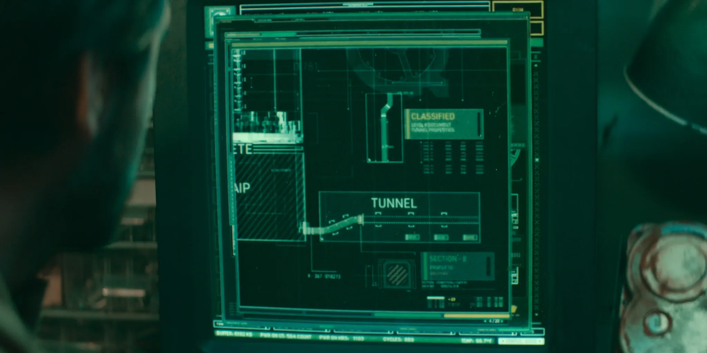

# Текущо състояние — след S01E01

**Knowledge boundary:** `S01E01`

## Работен модел

Силозът е очевидно **проектирана среда за оцеляване** с централизиран контрол върху популацията, информацията, правото, критичната инфраструктура и достъпа до външния свят.

Това **все още не ни казва** дали настоящата управляваща система е честна относно опасността навън или дали всички нейни механизми за контрол продължават да са необходими.

Най-силният работен модел след S01E01 е:

> **Обитателите на Силоза живеят в контролирана информационна система, в която външният свят засега не може да бъде независимо наблюдаван. Поне едно от визуалните представяния на външния свят е манипулирано или заменено.**

## Наблюдения с висок confidence

- Историческото знание е силно непълно.
- Официалното обяснение обвинява бунта за унищожаването на историческите архиви.
- Пактът е основополагаща система от правила/закони.
- Репродукцията се разрешава административно и се налага технически чрез контрацептивни импланти.
- Останалият в Allison имплант доказва поне едно скрито несъответствие между публично дадено разрешение и биологическата реалност.
- Relics и историческото знание са ограничени.
- Изричното заявяване на желание за излизане навън има обвързващи правни последици.
- Публичният екран показва мъртъв/безжизнен външен свят.
- Шлемът на Allison показва зелен и жив външен свят.
- По-старият cleaning файл на Jane Carmody също показва зелена външна среда.
- Allison чисти, след като вижда зелената сцена, а след това пада близо до дървото.
- HDD 18 съдържа изтрити исторически/технически материали, включително чертежи на Силоза.
- Чертежите съдържат classified тунел в долната част на структурата.

## Активни hypotheses

| ID | Hypothesis | Confidence |
|---|---|---:|
| H0 | Силозът е проектирана система за оцеляване. | H |
| H1 | Exterior visual-information pipeline-ът се манипулира умишлено. | H |
| H2 | Зелената гледка, показвана на cleaners, е обективно реална. | L |
| H3 | Мъртвата гледка на публичния екран е до голяма степен реална, а зелената гледка за cleaners е overlay. | M |
| H4 | Cleaning поведението е умишлено engineered чрез това, което се показва на cleaners. | M |
| H5 | Репродуктивният подбор се манипулира скрито отвъд официалния permit process. | H |
| H6 | Следбунтовият ред умишлено потиска историческо и техническо знание. | H |
| H7 | Официалният разказ за бунта е непълен или подвеждащ. | M |
| H8 | Judicial извършва скрито наблюдение отвъд обичайното правоприлагане. | L |
| H9 | George Wilkins може да е бил убит. | L |
| H10 | `SILO_COUNT` може да подсказва съществуването на повече от един Силоз. | VL |
| H11 | Classified тунелът води към неразкрита външна или вътрешна система. | L |

## Модел за външния свят — без преждевременно заключение

Три competing models остават отворени:

1. **Зелената гледка е реална** — публичният екран е фалшив.
2. **Мъртвата гледка е реална** — шлемът на cleaner-а показва синтетична/променена сцена.
3. **Нито един feed не е напълно автентичен** — и двете са обработени представяния.

Наличният evidence все още не е достатъчен, за да изберем убедително между тях.

## Ключова архитектурна улика

Чертежът на Силоза включва долен тунел, свързан с classified материал. Неговата посока и функция са неизвестни.

## Непосредствени watch targets за S01E02

- независимо evidence за външния свят;
- технически подробности за костюмите, шлемовете, камерите, въздуха или cleaning процеса;
- evidence за долния тунел;
- подробности за смъртта на George Wilkins;
- реалните правомощия на Judicial и IT;
- критериите за разрешаване на репродукция;
- допълнителни исторически записи, с които може да се тества официалният разказ за бунта.

Виж също:

- [`docs/episodes/S01E01.md`](docs/episodes/S01E01.md)
- [`docs/evidence-ledger.md`](docs/evidence-ledger.md)
- [`docs/open-questions.md`](docs/open-questions.md)
