# S01E01 — Първоначален запис на разследването

**Knowledge boundary:** `само S01E01`

Този документ умишлено не използва информация от по-късни епизоди, книгите, wiki, interviews, synopses, leaks или retrospective explanations.

## Episode-level заключение

S01E01 установява, че Силозът не е просто физическо убежище. Той е и строго контролирана **информационна, популационна, правна и mobility система**.

Най-силната загадка след този епизод не е просто „какво има навън?“, а:

> **Защо хората вътре и cleaner-ът отвън получават две несъвместими визуални представяния на един и същ външен свят?**

S01E01 доказва, че visual-information chain-ът като цяло не може да бъде приеман за надежден. Все още **не** доказва кое представяне е обективно вярно.

---

## Назовани персонажи

- **Holston Becker** — шериф.
- **Allison Becker** — съпругата на Holston.
- **George Wilkins** — човекът, който работи с Allison по нерегистрирания hard drive.
- **Juliette Nichols** — служител в Mechanical, която по-късно се свързва с Holston относно смъртта на George.
- **Bernard Holland** — ръководител на IT.
- **Jane Carmody** — предишен cleaner, чийто cleaning запис се намира на възстановения диск.

---

## Какво е казано на населението / в какво изглежда вярва то

Обитателите не знаят:

- защо човечеството е в Силоза;
- защо трябва да живеят под земята;
- какво се е случило навън;
- кой е построил Силоза и защо;
- защо външният свят е в сегашното си състояние;
- кога ще стане безопасно да излязат;
- пълната собствена история на обществото си.

Културният отговор по същество е: **днес не е безопасно**.

Унищожаването на историческото знание се приписва на бунтовниците. Официалният разказ твърди, че бунтът е унищожил архиви, hard drives, книги и по този начин голяма част от историята на Силоза.

Силозът използва **Пакта** като основополагащо тяло от правила/закони и като заместител на голяма част от историята, която вече не е достъпна.

### Важно epistemic разграничение

Това са институционални/социални убеждения. S01E01 не потвърждава независимо официалния разказ за бунта.

---

## Физическа структура

### Вертикален град

Придвижването между нивата е основно по стълби. Епизодът представя Силоза като достатъчно дълбок, така че пътуването от горните нива до дъното да може да отнеме приблизително цял ден.

Mechanical се намира близо до дъното и отговаря за генератора — критична survival dependency.

Visual evidence:

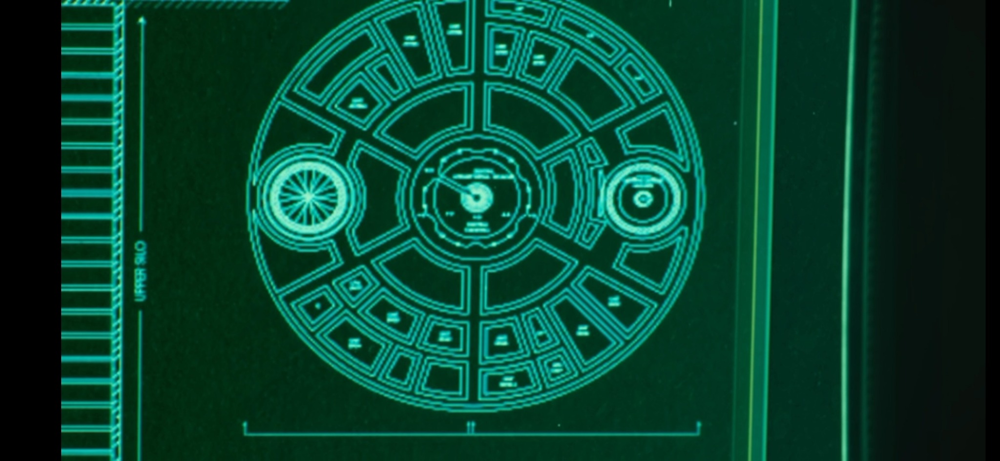

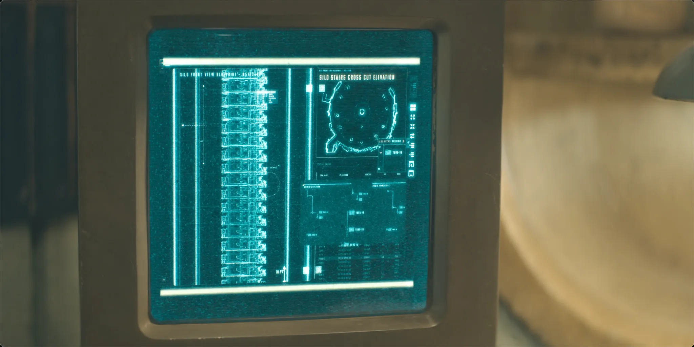

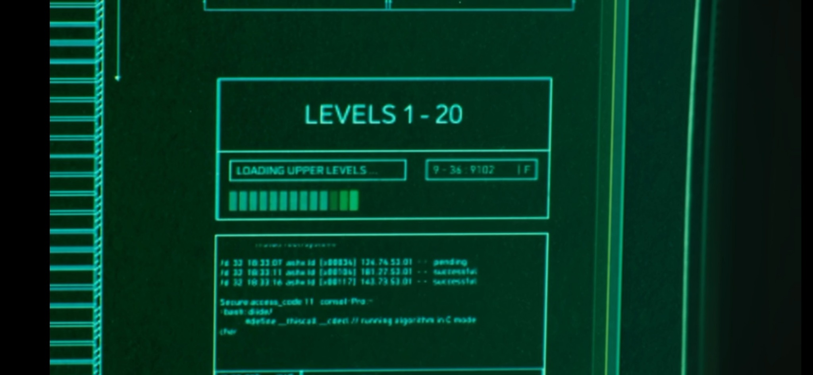

### Скрита / classified долна структура

Възстановените blueprint материали показват елемент, обозначен като **тунел**, близо до / под дъното на Силоза. Част от материала е изрично маркирана `CLASSIFIED`.

Това установява съществуването на архитектурен елемент, който очевидно не е част от обичайното публично знание. То **не** установява къде води тунелът или дали все още е използваем.

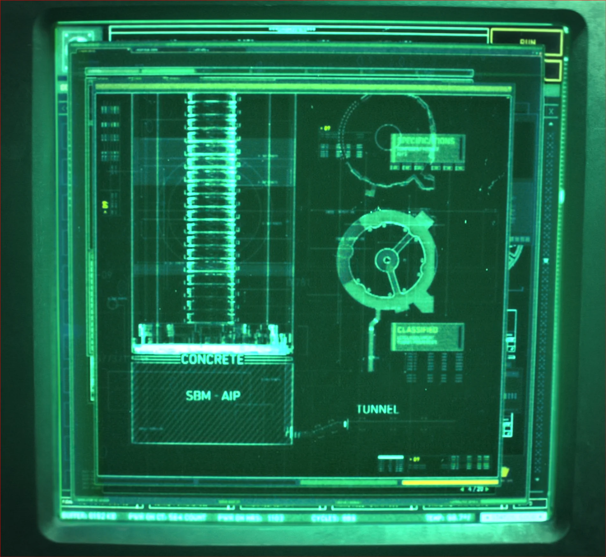

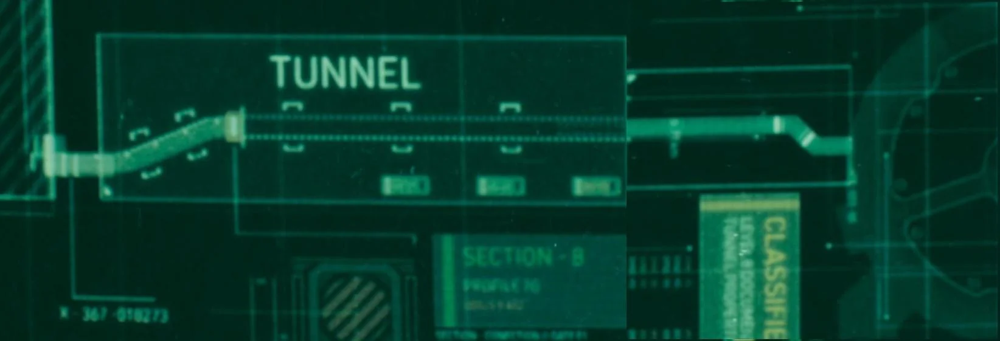

---

## Институции, видими в S01E01

### Sheriff's Department

- Holston Becker е шериф.
- Sheriff's Department прилага правилото, че човек, който изрично каже, че иска да излезе навън, ще бъде изпратен навън.
- Две години след смъртта на Allison, Holston получава информация от Juliette Nichols, която оспорва официалния разказ за смъртта на George Wilkins.

### IT

- Bernard Holland ръководи IT.
- Сървърите и digital information infrastructure на Силоза са под контрола на IT.
- Allison открива, че материал за възстановяване на изтрити файлове е бил премахнат; Bernard е свързан с премахването / контрола на тази информация.
- Bernard е представен като силно процедурен и защитник на границите на достъпа / бюрократичните ограничения.

### Judicial / правна власт

- Relics от времето преди познатия ред в Силоза са забранени.
- Историческото проучване е силно ограничено.
- Следователно Judicial веднага става важен за information-control модела, въпреки че точният обхват на surveillance правомощията му все още не е установен.

### Mechanical

- Намира се на / близо до дъното.
- Поддържа генератора.
- За George Wilkins по-късно се съобщава, че е бил прехвърлен в Mechanical преди смъртта си.
- Juliette Nichols работи там.

---

## контрол на населението и репродукция

Репродукцията се извършва само с разрешение.

Наблюдавани правила/механизми:

- двойките се нуждаят от authorization, за да опитват за дете;
- одобрението е ограничено във времето — приблизително една година;
- хората могат да кандидатстват повече от веднъж;
- контрацептивните импланти се използват като технически enforcement механизъм.

### Аномалията с Allison Becker

На Allison е казано, че контрацептивният ѝ имплант е премахнат, за да могат тя и Holston да опитат да имат дете.

По-късно тя сама премахва импланта и го показва като evidence, че той **не е бил премахнат**, както ѝ е било представено.

Това е по-силен evidence от обща теория за контрол на населението:

> S01E01 дава директен evidence, че поне едно репродуктивно разрешение може да е било административно одобрено, докато биологичната възможност за зачеване е била скрито блокирана.

Все още не знаем:

- кой е наредил това;
- дали се случва системно или селективно;
- как се избират репродуктивните approvals;
- защо approvals изглеждат социално видими / публично известни;
- дали има други population-control механизми освен контрацепцията.

---

## Бунтът, изгубената история и Freedom Day

Официалният разказ приписва унищожаването на историческите архиви на бунтовниците отпреди приблизително 140 години.

Силозът отбелязва възстановяване на реда/свободата, свързано с това събитие.

Видимото `06:06:06` е забележително, защото визуално наподобява `666`, но **засега не трябва да му приписваме значение**. Това е само visual clue.

Централният нерешен въпрос е дали бунтовниците действително са причинили загубата на историята, или това обяснение само по себе си е част от следбунтовия information regime.

---

## Hard drive 18

Allison и George получават стар hard drive, който очевидно не е част от нормалния inventory / accountability system и е идентифициран с номер **18**.

Те възстановяват изтрити материали от него.

### Наблюдения върху file system-а

Screenshots показват групи от файлове, свързани със **SILO YEAR 96** и **SILO YEAR 97**.

Това са архивни timestamps / folder labels. Те **не** доказват, че текущото действие се развива в Silo Year 97.

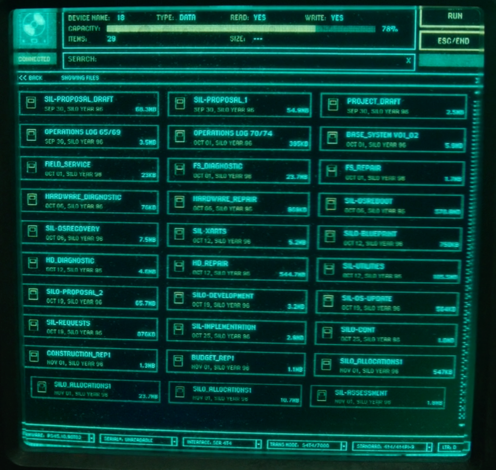

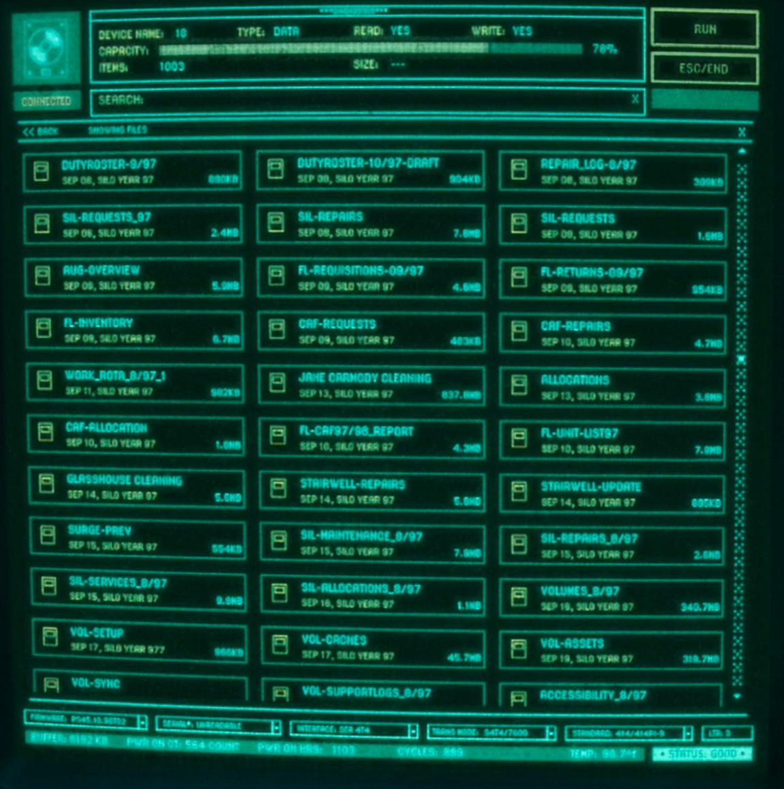

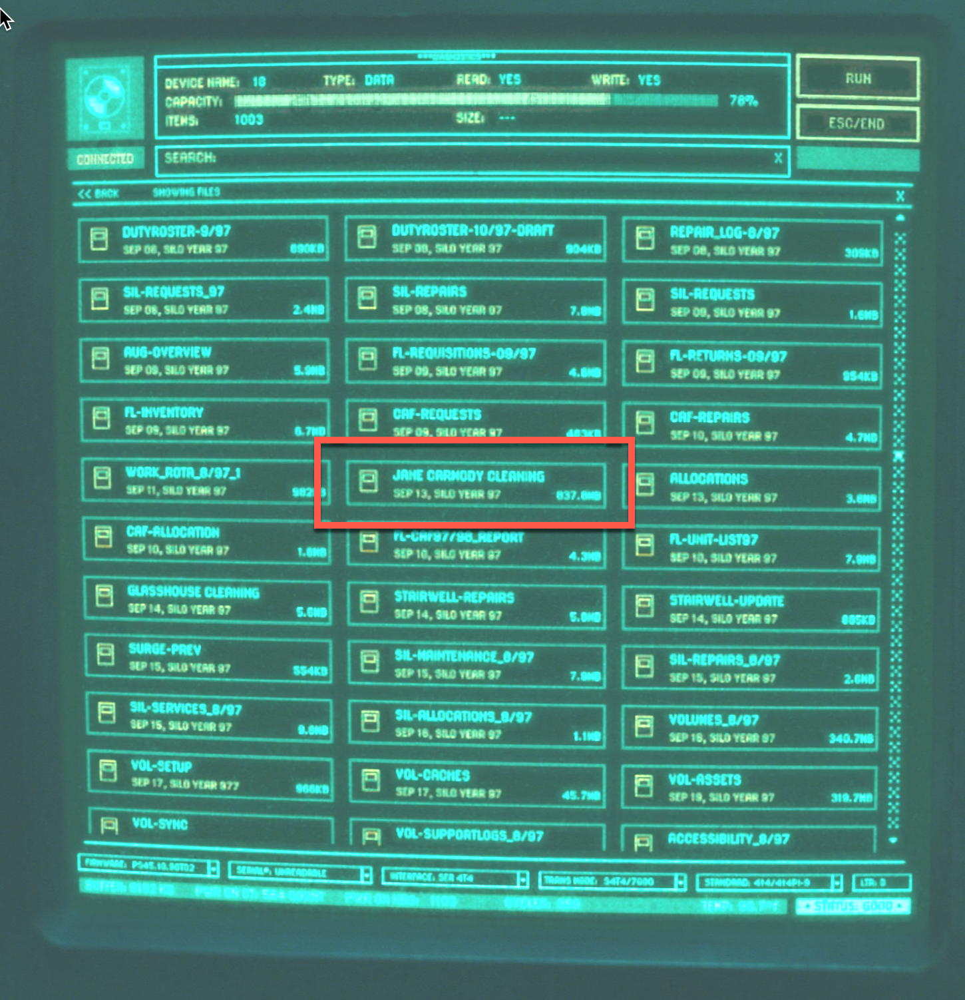

Видимите filenames включват материали, съответстващи на планиране / development на Силоза, с labels като `SILO-PROPOSAL`, `SILO-DEVELOPMENT`, `SILO-IMPLEMENTATION` и filename от типа `SILO_COUNT`.

`SILO_COUNT` е потенциално значим, но **не е достатъчен evidence, че съществуват множество силози**. Засега остава clue с нисък confidence до получаване на повече context.

### Blueprint материали

Дискът съдържа инженерни чертежи / архитектурни материали за Силоза.

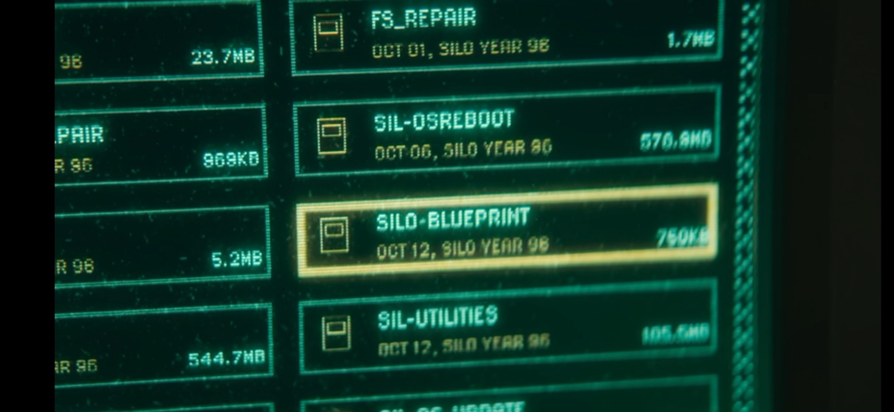

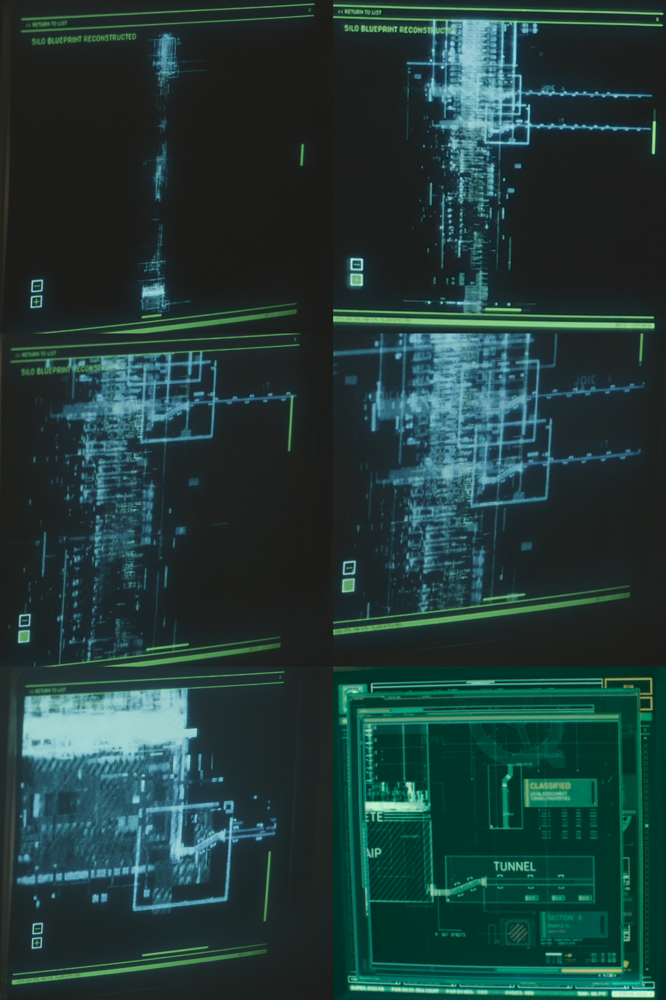

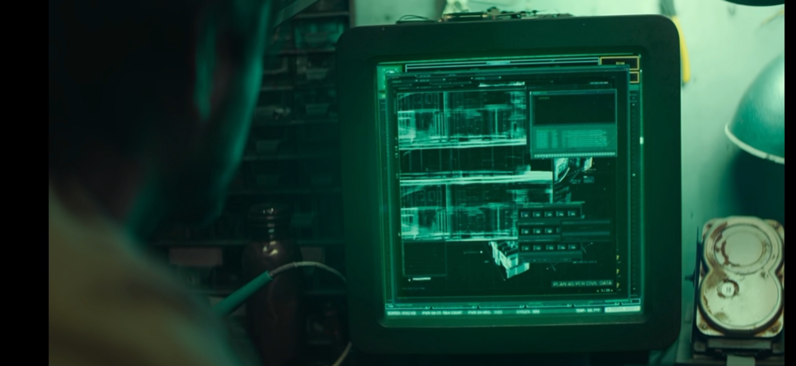

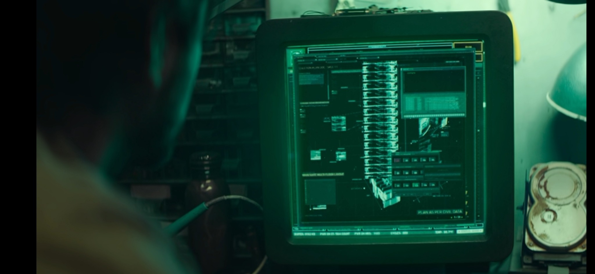

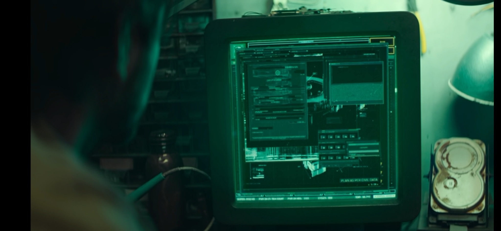

Blueprint комплектът е важен, защото съдържа структурна информация, която очевидно липсва от нормалното публично знание, включително долния тунел.

---

## Cleaning и противоречието във външните изображения

### Какво виждат хората вътре

Публичният exterior display представя сив, мъртъв и очевидно безжизнен пейзаж.

Това представяне подкрепя Институционално твърдение-а, че навън е смъртоносно и необитаемо.

### Какво вижда Allison след излизането

След като Allison заявява, че иска да излезе навън, тя е арестувана и изпратена да чисти.

През шлема си вижда:

- зелена трева;
- синьо небе;
- живи/летящи обекти, които тя не познава като птици;
- очевидно здрав пейзаж.

Преди да излезе, тя установява сигнал с Holston:

- ако навън действително е така, както показва екранът на Силоза, тя няма да чисти;
- ако това, което хората вътре виждат, е фалшиво, тя ще почисти, за да могат и те да видят по-добре.

Allison излиза, вижда зелената среда и **чисти**.

След това пада близо до дървото и изглежда, че умира.

### Cleaning файлът на Jane Carmody

Възстановеният hard drive съдържа по-стар запис с име `JANE CARMODY CLEANING`.

Този запис също показва зеленото / синьо представяне на външния свят.

Това е ключово, защото зеленото изображение не е просто твърдение на Allison или изолиран субективен ефект. Предишен cleaning запис съдържа същия клас визуална среда.

---

## Какво S01E01 действително доказва за външния свят

Доказва, че:

1. хората вътре получават изображение на мъртъв външен свят;
2. шлемът на Allison представя зелен външен свят;
3. по-старият cleaning запис на Jane Carmody също съдържа зелен exterior image;
4. Allison чисти, след като вижда зелената сцена;
5. Allison въпреки това пада навън близо до дървото.

Не доказва:

- че зеленият пейзаж е истинският външен свят;
- че мъртвият пейзаж е истинският външен свят;
- че самата външна атмосфера убива cleaners;
- че костюмът защитава или уврежда cleaners;
- че изображението в шлема е live;
- че публичният екран е live;
- че двата feeds идват от един и същ sensor;
- че cleaning действието технически подобрява това, което хората вътре могат да видят.

Следователно най-безопасният извод е:

> **Поне една част от exterior visual-information pipeline-а е манипулирана, заменена, филтрирана или по друг начин непрозрачна.**

---

## Първоначални hypotheses след S01E01

| ID | Hypothesis | Confidence | Status |
|---|---|---:|---|
| H0 | Силозът е engineered survival system, независимо дали текущото управление е доброжелателно. | H | Strengthened |
| H1 | Exterior visual-information pipeline-ът се манипулира умишлено. | H | Active |
| H2 | Зелената външна среда, показвана на cleaners, е обективно реална. | L | Active competitor |
| H3 | Мъртвата външна среда на публичния екран е до голяма степен реална; зелената гледка на cleaner-а е overlay / simulation. | M | Active competitor |
| H4 | Cleaning е behaviorally engineered: на cleaner-а се показва нещо, което силно го мотивира да чисти. | M | Active |
| H5 | Репродуктивното разрешаване се манипулира селективно отвъд публично заявения permit process. | H | Active |
| H6 | Следбунтовият ред умишлено потиска предбунтовото историческо и техническо знание. | H | Active |
| H7 | Бунтовниците може да не са единствено отговорни за унищожаването на историческото знание. | M | Active |
| H8 | Judicial / правните власти извършват скрито наблюдение отвъд публично разбираното прилагане. | L | Candidate |
| H9 | George Wilkins може да е бил убит, вместо да е починал от самоубийство. | L | Candidate |
| H10 | `SILO_COUNT` може да се отнася до повече от един Силоз. | VL | Clue only |
| H11 | Classified долният тунел свързва Силоза с неразкрита локация / система. | L | Candidate |

---

## Ключов competing model: кой външен свят е реален?

### Model A — зеленият външен свят е реален

Evidence в подкрепа:

- Allison го вижда директно през шлема;
- старият cleaning файл на Jane Carmody показва същия тип imagery;
- решението на Allison да чисти съвпада с предварителния ѝ сигнал, че вътрешният екран е фалшив.

Проблеми:

- Allison въпреки това пада и очевидно умира;
- не знаем дали helmet feed-ът е live или synthetic;
- повтарящото се сходно изображение само по себе си може да подсказва controlled overlay.

### Model B — мъртвият външен свят е реален

Evidence в подкрепа:

- публичният екран постоянно показва мъртвия пейзаж;
- Allison пада малко след exposure;
- зелената сцена може да е designed helmet overlay.

Проблеми:

- публичният feed също може да е манипулиран;
- старият файл на Jane Carmody доказва, че зелено imagery е съществувало в cleaning системата от известно време;
- cleaning поведението изглежда свързано с това, което cleaners виждат.

### Model C — нито един feed не е напълно надежден

Трета възможност е и двете представяния да са обработени или частично synthetic.

**Confidence:** `M`

Този model в момента има силна explanatory value, защото S01E01 не ни дава нито едно независимо, authenticated наблюдение на външния свят.

---

## Falsification targets за следващите епизоди

Следващите епизоди трябва да се наблюдават за evidence, който може да различи competing models, вместо просто да добавя още mystery.

Особено ценни биха били:

- външен изглед от независим sensor или физически прозорец;
- evidence дали шлемът на cleaner-а съдържа система за визуално показване;
- evidence за въздуха в костюма / seals / toxins / decontamination;
- множество cleaning видеа с повтарящи се визуални детайли;
- доказателство дали публичният екран е live или prerecorded;
- техническа информация за външната камера;
- посоката / предназначението на classified тунела;
- независими исторически записи, които противоречат или потвърждават официалния разказ за бунта;
- evidence кой контролира репродуктивните approvals и премахването на импланти.

---

## Индекс на visual evidence

Всички screenshots от S01E01, използвани в този record, се намират в:

`assets/S01E01/screenshots/`

Комплектът включва HDD file listings, Silo-year archive screens, cleaning файла на Jane Carmody, blueprint-и на Силоза, чертежи на долния тунел, dimensions, структурата на стълбите и диаграми на горните нива.
