# S01E02 — разследващ запис за епизода

**Knowledge boundary:** `S01E02`

Този документ фиксира knowledge state-а непосредствено след S01E02. Не се използва информация от S01E03+, книгите, wiki, interviews, leaks или retrospective explanations.

## Episode-level извод

S01E02 не решава централната загадка за външния свят, но значително подобрява модела в три направления:

1. **Разделението във визуалното представяне на външната среда е повторяем системен феномен.** Holston вижда зелена среда през шлема на cleaner-а, докато хората вътре виждат мъртва среда по време на същото cleaning събитие.
2. **Официалното „дъно“ на Силоза не е физическото дъно на комплекса.** Под Down-deep има Pact-restricted pre-Rebellion инфраструктура, construction cavity и огромна изоставена excavation machine.
3. **Разследванията на Allison, George и Juliette вече се свързват физически.** HDD 18, материал за възстановяване и документ с почерк на Allison се появяват в скрития cache на George под Силоза.

---

# 1. Holston cleaning — повторение на visual contradiction

## 1.1 Cleaner POV

Holston излиза навън и през шлема вижда зелен, жив пейзаж — синьо небе, растителност, здраво дърво и летящи птици.

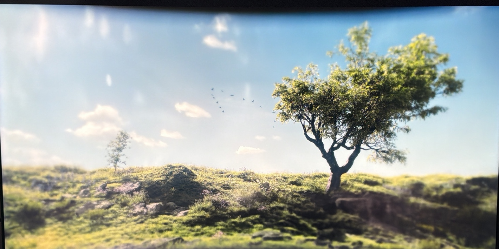

**Клас:** `Direct observation / repeated visual evidence`

Това е вторият cleaner, за когото директно виждаме lush representation, след Allison. Заедно с `JANE CARMODY CLEANING` вече имаме три отделни прояви на един и същ клас зелена външна картина.

## 1.2 Public POV

По време на същото cleaning хората вътре виждат Holston върху мъртъв/безжизнен терен.

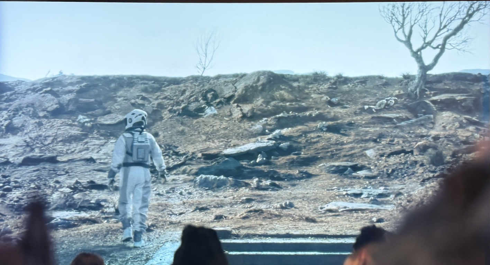

Публичният feed показва и тялото на Allison близо до дървото, докато Holston се приближава.

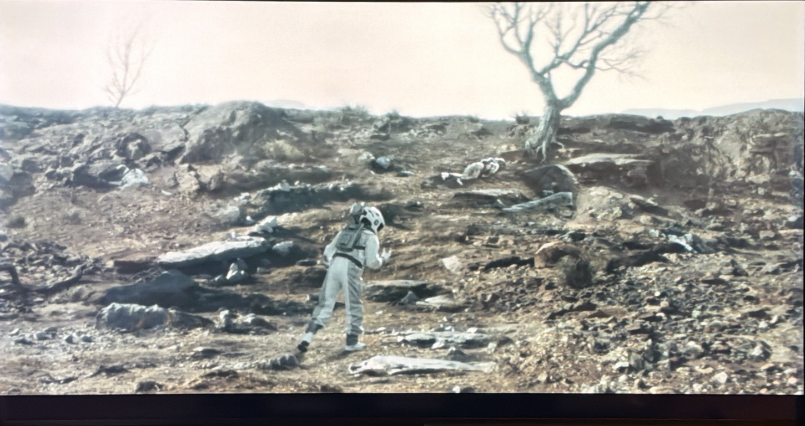

**Клас:** `Direct observation / simultaneous incompatible representations`

Това е по-силно от S01E01, защото двата visual channels вече са наблюдавани в рамките на едно и също cleaning събитие.

## 1.3 Cleaning behavior

Holston вижда lush scene и след това се връща към exterior sensor/camera и чисти. Това е вторият наблюдаван cleaner, при когото lush perception е последвана от cleaning behavior.

**Impact:** H4 — че cleaning поведението е engineered чрез това, което cleaner-ът вижда — се засилва от `M` към `H`.

## 1.4 Distress, helmet removal и death

Holston показва видим distress и се опитва да свали шлема.

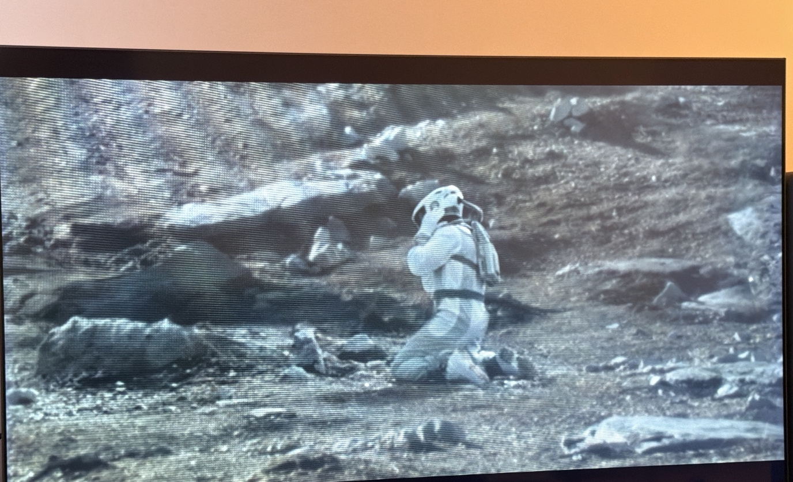

След като успява да го свали, достига Allison и пада/умира до нея.

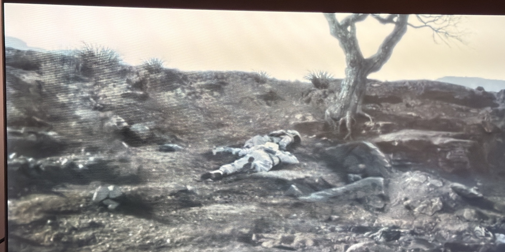

**Какво това доказва:**

- Holston изпитва acute distress преди collapse-а;
- шлемът може физически да бъде свален;
- Holston достига реалното физическо местоположение на Allison;
- публичният feed коректно показва поне позицията на Allison и Holston на терена.

**Какво това не доказва:**

- какво точно го убива;
- дали причината е външната атмосфера, suit/helmet system, life-support, toxin, radiation или друг механизъм;
- дали целият barren public feed е реален само защото позицията на телата изглежда реална.

---

# 2. Public exterior displays са част от ежедневната инфраструктура

S01E02 показва големи exterior displays и извън зоната около Sheriff-а. Те са интегрирани в общи социални пространства, включително communal/dining area.

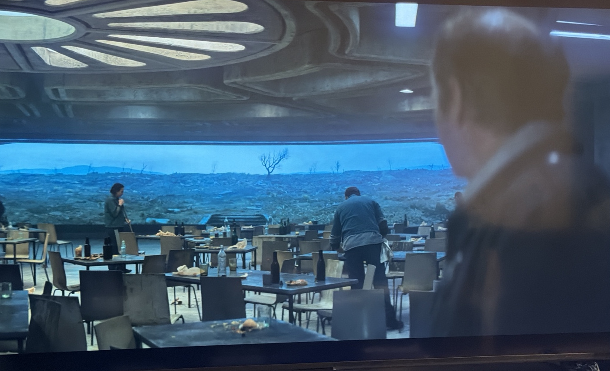

**Пряко наблюдение:** exterior representation-ът се разпространява на множество публични места в Силоза.

**Извод:** това не е локален административен монитор, а част от общата публична информационна инфраструктура.

Все още не е установено, че има такъв display на всяко ниво.

---

# 3. Вътрешна география и логистика

S01E02 използва/затвърждава три основни регионални категории:

- **Up-top** — горната административна част;
- **Mids** — междинните нива;
- **Down-deep** — най-долните обитаеми нива, включително Mechanical.

Това са социално-пространствени региони, не доказателство за три геометрично равни секции.

## 3.1 Силозът има 144 нива

Диалогът изрично посочва слизане през **144 нива**.

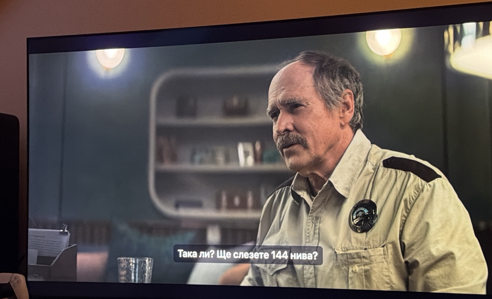

Това прецизира S01E01 модела от „много дълбока вертикална структура“ към конкретна височина от 144 levels.

## 3.2 Porters / разносвачи

В Силоза има отделна логистична роля за пренасяне на стоки и пратки между нивата.

**Извод:** липсата на асансьори създава цял слой от човешка логистика, който компенсира бавния вертикален транспорт.

---

# 4. Управление и социален контрол

## 4.1 Judicial / Sims

Присъствието на Sims от Judicial предизвиква видимо напрежение и страх.

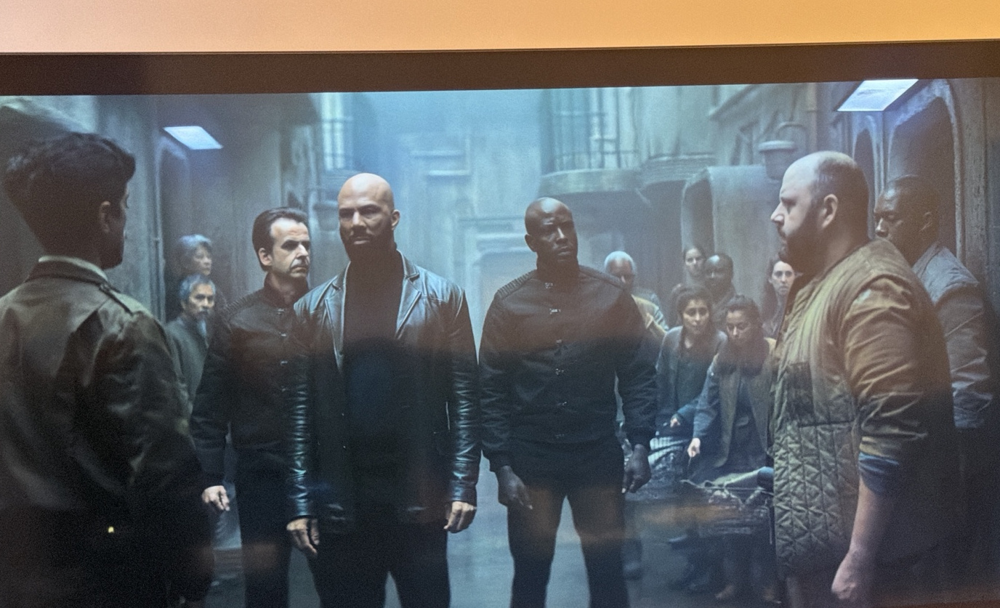

Това подкрепя модел, в който Judicial има coercive enforcement функция, а не само формална юридическа роля.

То **не е достатъчно** да потвърди H8 за скрито наблюдение. Наблюдението остава отделен отворен въпрос.

## 4.2 Relationship approval

Диалогът подсказва, че официалните партньорски/семейни връзки подлежат на institutional approval.

Това разширява модела за социален контрол отвъд разрешенията за репродукция: системата потенциално регулира както раждаемостта, така и формалното създаване на двойки.

## 4.3 Mines като наказателна дестинация

Мините са споменати като форма на наказание / punitive labor destination.

Това показва, че punishment spectrum-ът не се свежда само до cleaning; има и вътрешни наказателни механизми.

---

# 5. Holston → Juliette succession

Holston номинира **Juliette Nichols** за свой наследник като Sheriff и оставя badge-а си за нея.

Това е значимо по две причини:

1. човек от **Down-deep / Mechanical** е предложен за една от най-високите law-enforcement позиции в Up-top;
2. Holston вероятно избира човек, свързан с George и готов да оспорва официални версии.

Мотивът му за избора остава inference, не установен факт.

---

# 6. Историческа хронология

## 6.1 Mayor journals и Year 97

Кметицата преглежда mayor journals и казва, че е стигнала до **'97**.

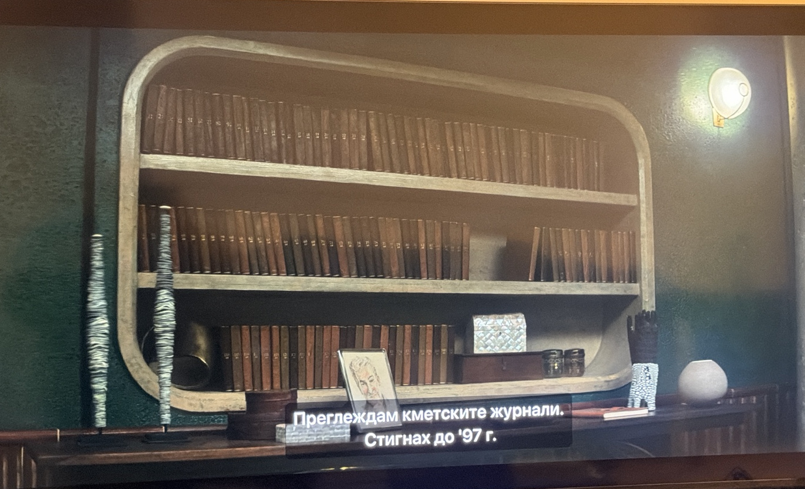

Това създава независима връзка с `SILO YEAR 96` / `SILO YEAR 97` от HDD 18.

**Силен извод:** HDD year labels и mayor journals вероятно използват един и същ вътрешен Silo calendar.

Това вече е значително по-силно от S01E01, когато `SILO YEAR 96/97` трябваше да се третират само като archive labels.

## 6.2 140 години post-Rebellion peace

Кметицата описва мира след бунта като продължил **140 години**.

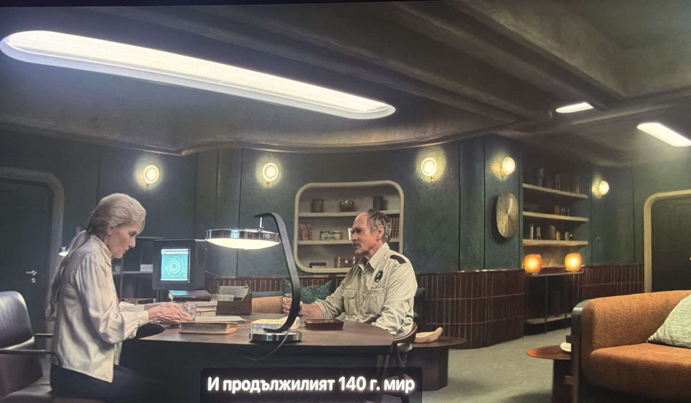

Това подкрепя chronology model:

`Rebellion → ~140 години post-Rebellion order → present`

Ако `Year 97` е година 97 от същия post-Rebellion calendar, тя би била приблизително 43 години преди настоящето. Това е **inference**, защото още не знаем дали календарът започва точно в момента на бунта и дали „140 години“ е закръглено число.

## 6.3 Pre-Rebellion периодът остава неизвестен

Свидетелството на Mayor подсказва ясно историческо прекъсване: има период **преди Rebellion**, за който текущата институционална памет е силно ограничена/неизвестна, и документиран период след Rebellion.

---

# 7. Pact-forbidden инфраструктура под Down-deep

## 7.1 Explicit Pact restriction

Juliette отвежда придружаващия law-enforcement officer до зона, където табелата изрично казва, че продължаването е наказуемо нарушение на Pact.

Това е direct evidence, че в самия Силоз има физически пространства, скрити/ограничени не просто по служебен ред, а чрез foundational law.

## 7.2 Нестандартен достъп

Зад restriction-а има малък неофициален/аномален отвор, а не стандартна врата или обществен проход.

Зад него има реален tunnel system.

Juliette казва, че структурата очевидно е **отпреди бунта**.

**Epistemic class:** `Character testimony + visual evidence`.

Това прави pre-Rebellion origin-а силно подкрепен, но не независимо датиран.

---

# 8. Под обитаемия Силоз има construction layer

От забранения tunnel има вторичен вертикален достъп надолу. След слизането става ясно, че персонажите се намират **под официално обитаемия Silo**.

## 8.1 Excavation machine

В огромна цилиндрична construction cavity има масивна изоставена машина.

Персонажите предполагат, че това са останките от машината, която е **изкопала Силоза**.

**Разграничение:**

- съществуването на машината и cavity-то е `Direct visual evidence`;
- че именно тя е изкопала Силоза е `Character inference/testimony`.

## 8.2 Structural cap над машината

Над excavation cavity се вижда масивен horizontal structural layer/cap.

In-universe theory е, че след excavation-а машината не е могла да бъде извадена и construction layer-ът е бил запечатан под дебел бетонен cap (споменат приблизително като 9 m).

Самият screenshot потвърждава наличието на голям structural boundary, но **не измерва независимо 9 m** и не доказва материала лабораторно.

## 8.3 Down-deep ≠ физическото дъно

S01E02 променя архитектурния модел:

`144 inhabited levels / Down-deep`

↓

`sealed structural bottom / cap`

↓

`hidden construction cavity`

↓

`excavation machine + lower machine levels`

↓

`flooded lowest area`

Това е един от най-големите model changes след епизода.

---

# 9. Flooded bottom и загадъчната врата

Най-ниската видима зона под excavation machine е широко наводнена.

Juliette има силен страх от вода, което е реална бариера за нейното лично изследване на тази зона.

George е търсил **врата**, която е видял на рисунка. Според описанието тя се намира в края на **къс tunnel** в най-долната част на construction cavity.

George оставя съобщение, че е **намерил това, което търси**. Juliette не предава тази част от съобщението на придружаващия law-enforcement officer.

Най-силният working inference е:

> **George вероятно е локализирал търсената врата / вход към нея в или около flooded bottom под excavation machine.**

Това все още не е `Confirmed`, защото:

- не виждаме самата врата;
- не знаем дали George само я е локализирал или е преминал отвъд нея;
- не е доказано директно, че това е същата tunnel/door структура от HDD 18 blueprint-а.

---

# 10. George's hidden workspace и evidence cache

George е изградил скрито работно/cache пространство в строителния слой под Силоза.

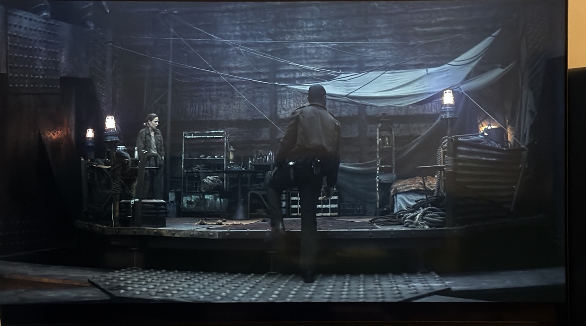

Това показва, че той не е посещавал мястото случайно, а го е използвал систематично.

## 10.1 Relics

George е събирал relics. Сред тях има portable video camera.

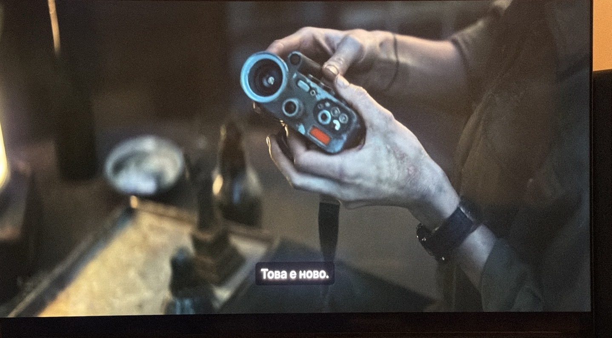

В система, в която визуалната информация е централна загадка, способността за запис/съхраняване на видео е особено важна следа, но съдържанието на камерата остава неизвестно.

## 10.2 HDD 18 и материалът за възстановяване

В скрит cache / backpack се намират HDD 18 и принтирани инструкции за възстановяване на изтрити файлове.

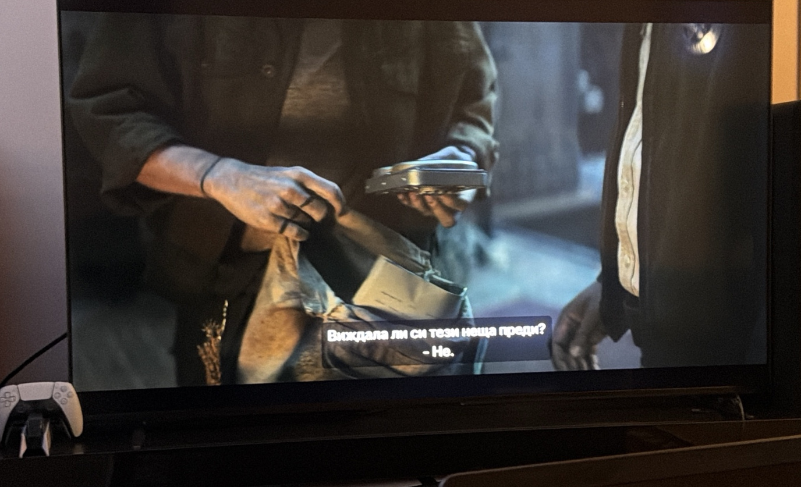

Това директно връзва S01E02 с IT suppression линията от S01E01: George е запазил offline material за възстановяване на deleted files, след като knowledge за тази техника е било ограничено/премахнато.

## 10.3 Allison handwriting

Върху recovery document има ръкописни бележки, които Holston разпознава като почерк на **Allison Becker**.

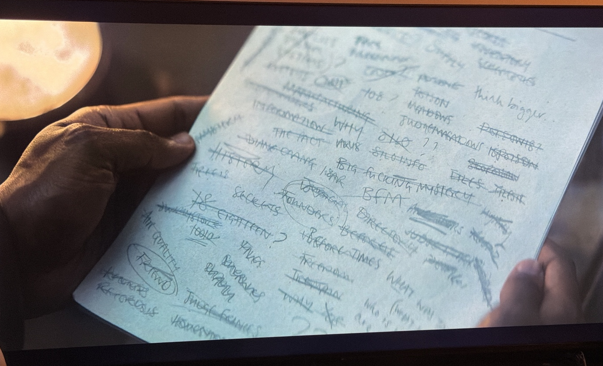

Това създава физическа provenance chain:

`Allison → George → HDD 18 / recovery material → hidden cache → Juliette`

Така George не просто е продължил независимо любопитство; той е запазил материал от първоначалното разследване на Allison/George.

---

# 11. George и Juliette

S01E02 потвърждава, че **George и Juliette са били във връзка**.

Това обяснява част от личния stake на Juliette в разследването на смъртта му, но не доказва, че нейните подозрения са правилни.

George оставя PEZ relic и бележки/breadcrumbs, които насочват Juliette към скритото пространство и evidence cache-а.

Това подкрепя inference, че George съзнателно е подготвил trail, който Juliette да може да последва.

---

# 12. Hypothesis movements след S01E02

| ID | Преди | След | Movement | Причина |
|---|---:|---:|---|---|
| H0 | H | H | → | Construction evidence засилва engineered nature-а, но survival purpose-ът все още не е напълно обяснен. |
| H1 | H | VH | ↑ | Allison, Jane Carmody и Holston показват повторяем cleaner lush view, докато public feed е barren. |
| H2 | L | L | → | Lush view остава възможен real exterior, но няма независима authentication. |
| H3 | M | H | ↑ | Публичният feed коректно показва физическите позиции на телата; Holston достига Allison след сваляне на шлема. Това подкрепя надеждността на публичния feed на ниво обекти, но не доказва целия пейзаж. |
| H4 | M | H | ↑ | Holston е втори cleaner, при когото lush view е последван от cleaning. |
| H5 | H | H | → | Няма нов decisive reproductive evidence. |
| H6 | H | H | → | Забранената от Pact инфраструктура отпреди Rebellion и материалът за възстановяване засилват модела за контрол на информацията. |
| H7 | M | M | → | Историческата празнина се потвърждава, но официалният разказ за бунта още не е директно опроверган. |
| H8 | L | L | → | Sims/Judicial показва coercive presence, но hidden surveillance още не е доказан. |
| H9 | L | L | → | George е водил чувствително разследване, но hypothesis за убийство още няма директно evidence. |
| H10 | VL | VL | → | Няма нов evidence за multiple Silos. |
| H11 | L | M | ↑ | Реално съществува скрит lower tunnel/construction system; идентичността му с blueprint tunnel-а още не е директно доказана. |

## Нови hypotheses

| ID | Hypothesis | Confidence | Status |
|---|---|---:|---|
| H12 | Pact-forbidden tunnel system е същата или пряко свързана структура с `CLASSIFIED` lower tunnel от HDD 18 blueprint-а. | H | Active |
| H13 | George е намерил вратата / входа към нея в края на short tunnel при flooded bottom под excavation machine. | H | Active |
| H14 | Cleaner mortality включва suit/helmet/life-support фактор, а не е обяснима само с ambient exterior environment. | M | Active |
| H15 | `SILO YEAR 96/97` и mayor journals използват един и същ post-Rebellion calendar. | H | Active |
| H16 | Текущият ред съзнателно държи първоначалния строителен слой физически и юридически извън нормалния достъп. | H | Active |
| H17 | Judicial/Sims изпълнява coercive enforcement функция отвъд чисто юридическо adjudication. | M | Active |

---

# 13. Най-важни отворен въпросs след S01E02

- Кой exterior representation е обективно реален?
- Какво точно причинява death/collapse на cleaners?
- Какво вижда cleaner непосредствено след сваляне на helmet-а?
- Дали публичният feed е реален feed от камера с обработка, или също е генериран/модифициран?
- Какво има зад вратата, която George е търсил?
- George само е намерил вратата или е успял да я отвори?
- Дали flooded bottom е естествено наводняване, side effect от construction history или deliberate barrier?
- Classified tunnel от HDD 18 същият ли е tunnel system, който виждаме физически?
- Кой е построил/проектирал Силоза и original construction layer?
- Защо Pact криминализира достъпа до pre-Rebellion инфраструктура?
- Какво има на video camera relic-а?
- Кой е убил George, ако official suicide account е неверен?
- Как ще реагират Judicial/IT на номинацията на Juliette за Sheriff?

---

# 14. Knowledge state, който трябва да запазим

След S01E02 вече знаем, че Силозът не е само вертикална 144-level habitation structure. Под него има **скрит, Pact-restricted construction layer**, съдържащ вероятната excavation machine, flooded lower zone и вероятен tunnel/door endpoint, който George е търсил.

Паралелно загадката за външната среда става по-строга: зелената гледка за cleaner-а е **повтаряемо системно поведение**, а public barren feed има поне частично физическо потвърждение чрез позицията на Allison и Holston.

Нито една от тези две линии още не е достатъчна, за да обявим окончателно:

- кой exterior feed е реален;
- какво убива cleaners;
- какво има зад lower door;
- защо тази инфраструктура е скрита.

**Следваща knowledge boundary:** `S01E03`
