# S01E03 — Запис на разследването по епизода

**Граница на знанието:** `само S01E03`

Този документ фиксира състоянието на знанието след S01E03. Не се използва информация от S01E04+, книгите, уикита, интервюта, изтичания или ретроспективни обяснения.

---

## Обобщение на ниво епизод

S01E03 разширява модела на Силоза в три направления:

1. **социална география** — нива 9, 12, 14 и 50 вече дават конкретни ориентири за горните/средните нива; виждаме медицинска, Judicial, обществена и развлекателна инфраструктура;
2. **енергийна система** — Mechanical поддържа турбинна/генераторна система, но основният източник на пара идва отдолу и произходът му е неизвестен;
3. **визуален път за външната среда** — при изключване на захранването публичният екран за момент показва зелено изображение на външната среда, което доказва, че зеленото представяне съществува и в публичния визуален канал, не само в шлема при почистване.

Епизодът завършва и с голям управленски шок: кметицата умира след привидна атака/отравяне. Времевата близост до назначаването на Juliette за Sheriff създава хипотеза за мотив, но не доказва причината или извършителя.

---

# 1. Juliette и наводненото дъно

Juliette се връща от строителната зона под Силоза и не остава да търси съобщената долна врата при наводненото дъно.

### Епистемичен ефект

Това **не опровергава** H13 от S01E02.

То означава само:

- Juliette още не е проверила лично съобщеното местоположение на вратата;
- наводненото дъно остава реална физическа/психологическа бариера;
- твърдението на George „намерих това, което търсех“ остава най-силната връзка към хипотезата за вратата.

### Движение на хипотезата

**H13 — George е намерил вратата или входа към нея при наводненото дъно:** остава `H`; няма ново пряко потвърждение.

---

# 2. Пространствена карта — нива 9, 12, Judicial и ниво 50

S01E03 дава редица полезни пространствени ориентири.

## Ниво 9

Кметицата е показана на ниво 9 по пътя надолу към Juliette.

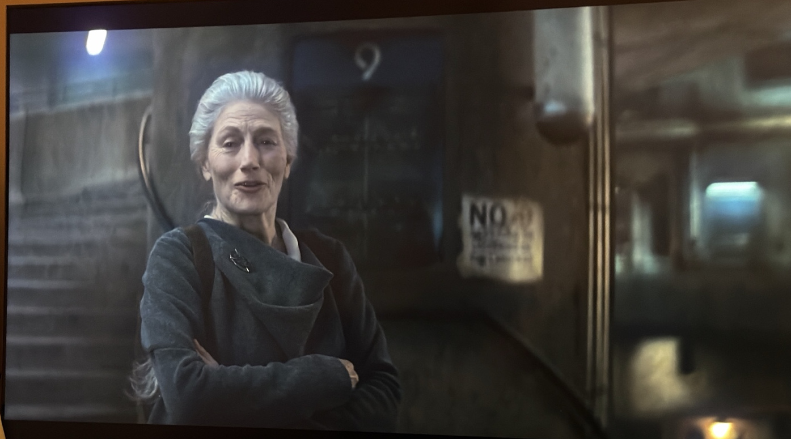

От същата зона има силен поглед нагоре към горната част на Силоза.

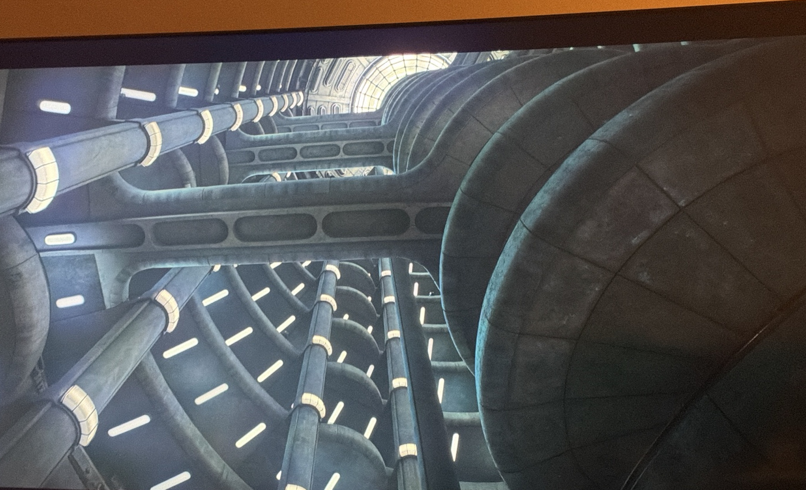

Тези кадри са основно **изграждане на света / пространствен контекст**: показват мащаба на вертикалното придвижване и архитектурното усещане на горните нива.

## Ниво 12

Ниво 12 показва типична архитектура на площадка и стълби с разклонено движение около централната шахта.

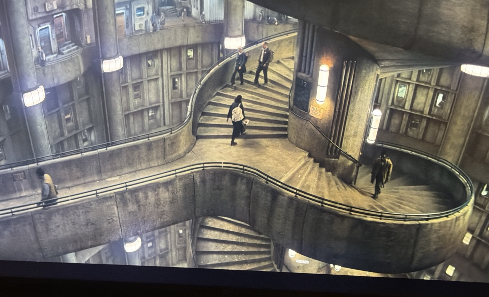

## Judicial — около ниво 14

Два последователни съседни кадъра показват:

- вход към `JUDICIAL`;
- непосредствено съседно означение за ниво `14`.

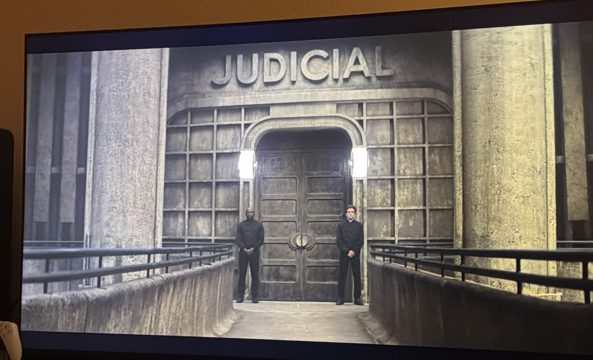

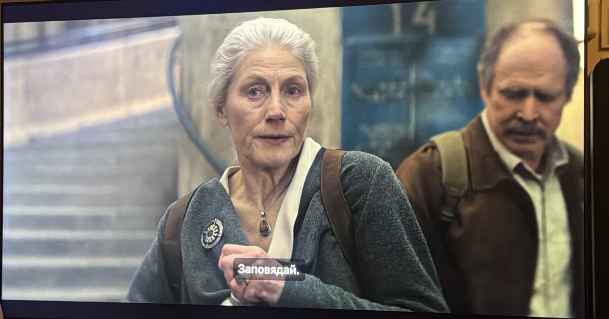

### Заключение

**Силен пространствен извод:** Judicial се намира на или непосредствено около **ниво 14**.

Това не е една табела „Judicial — 14“, затова го държим като силен извод от последователността на кадрите, а не като пряк надпис в един кадър.

## Ниво 50 — `Mids`

Ниво 50 е показано като част от **`Mids`**.


Там има значима медицинска инфраструктура, включително неонатална/бебешка клиника.

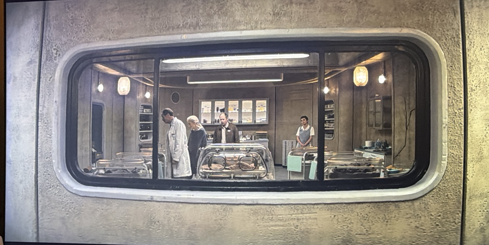

---

# 3. Juliette, баща ѝ и вертикалната социална сегрегация

Бащата на Juliette е лекар на ниво 50 в `Mids`.

Juliette е отишла в Mechanical / долните нива — почти 100 нива разлика в едната посока.

Диалогът установява, че баща ѝ не я е виждал от много време, защото един почивен ден не е достатъчен, за да слезе до нея и да се върне.

Това е първият силен пример на човешко ниво за социалното последствие от вертикалната архитектура.

### Силен извод

Липсата на асансьори не създава само неудобство. Тя създава **де факто социално разделение** между различните региони на Силоза.

Преместването `Mids → Mechanical` може да означава почти социална миграция вътре в едно и също затворено селище.

### Нова хипотеза

**H18 — Липсата на бърз вертикален транспорт създава де факто социална сегрегация между горните, средните и долните нива.**

**Увереност:** `H`

**Статус:** `Активна / Подсилена`

---

# 4. Вътрешни градини и обществен живот

S01E03 показва голяма озеленена вътрешна зона с дървета, храсти, пътеки и ресторант/обществено пространство за сядане.

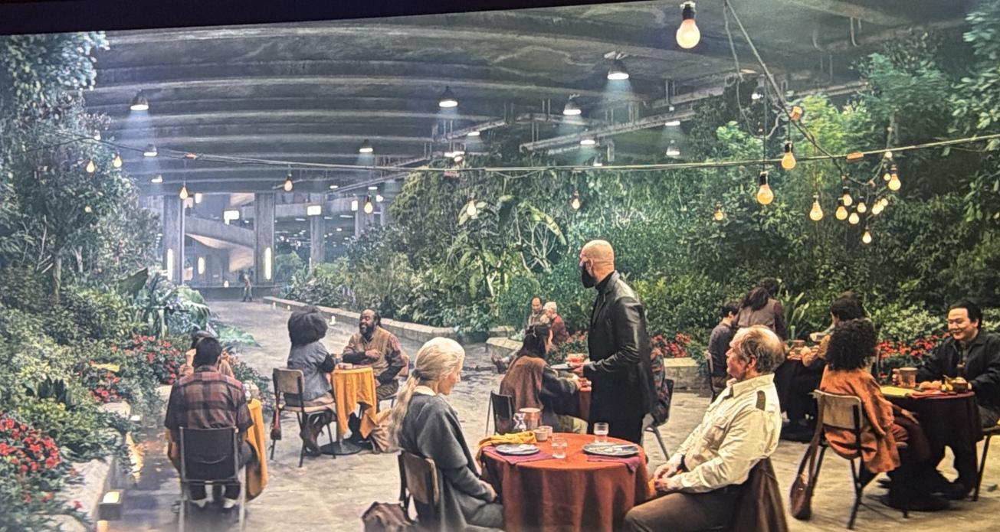

Това е важна корекция в изграждането на света: Силозът не е само бункерна/индустриална среда. Има проектирани развлекателни и обществени пространства, които симулират част от усещането за обществен живот на открито.

Нивото на тази зона остава неизвестно към S01E03.

---

# 5. Bernard / IT срещу Juliette като Sheriff

Bernard Holland открито се противопоставя Juliette да стане Sheriff.

Като аргумент той посочва нейно старо нарушение: кражба на **изолационна лента**.

### Пряка позиция на персонажа

Bernard не иска Juliette за Sheriff и използва старо дисциплинарно/ресурсно нарушение срещу нея.

### Управленски извод

Ръководството на IT очевидно участва политически/институционално в обсъждането на наследяването на поста Sheriff, въпреки че Sheriff’s Department е отделна структура.

Това не доказва, че Bernard има формално право на вето.

### Отворен въпрос

Колко формална власт има IT върху назначения извън собствената си структура?

---

# 6. Самоубийството като престъпление срещу Силоза

S01E03 установява, че самоубийството се третира като **сериозно престъпление срещу Силоза**.

Това е необичайна правна рамка, защото извършителят е мъртъв.

### Пряк институционален факт

Самоубийството не се третира само като личен акт, а като престъпление срещу Силоза.

### Нова хипотеза

**H19 — Правната забрана срещу самоубийството отразява принцип, че индивидуалният живот се разглежда като ресурс/задължение към колективната система за оцеляване.**

**Увереност:** `M`

Алтернативи остават отворени: обществена стабилност, възпиране, последици за семейството, запазване на работната сила или комбинация.

### Значение за George

Официалният разказ за самоубийството на George не само обяснява смъртта му, а потенциално го поставя и в морална/правна категория на човек, нарушил задълженията си към Силоза. Това може да влияе върху обществената памет за него, но към S01E03 нямаме пряко доказателство за умишлено очерняне с цел прикриване.

---

# 7. Неоторизираното радио е строго забранено

Пактът строго забранява самоделно или неоторизирано радиооборудване.

### Пряко институционално правило

Независимата радиокомуникационна технология е забранена.

### Нова хипотеза

**H20 — Пактът ограничава независимите комуникационни технологии, така че комуникацията между нивата да остава в контролирани канали.**

**Увереност:** `M`

Алтернативно или допълнително обяснение може да бъде смущение в критични системи или оперативна безопасност. Наличните доказателства още не позволяват да изберем мотив.

Това обаче е важно в комбинация с H18: физическото разделение между нивата + ограниченията върху неконтролираната комуникация могат да усилват социалната фрагментация.

---

# 8. Население

Диалогът дава приблизителна базова стойност:

> **Населението на Силоза ≈ 10 000 души.**

При 144 нива това е полезен мащаб за модела на ресурси и население, но хората очевидно не са равномерно разпределени — има индустриални, административни, медицински, обществени и други нежилищни нива/зони.

---

# 9. SILOMAIL и 8-часовото прекъсване на захранването

Терминал показва централизирано съобщение:

> по заповед на кметицата започва **8-часово прекъсване на електрозахранването** в 22:00.

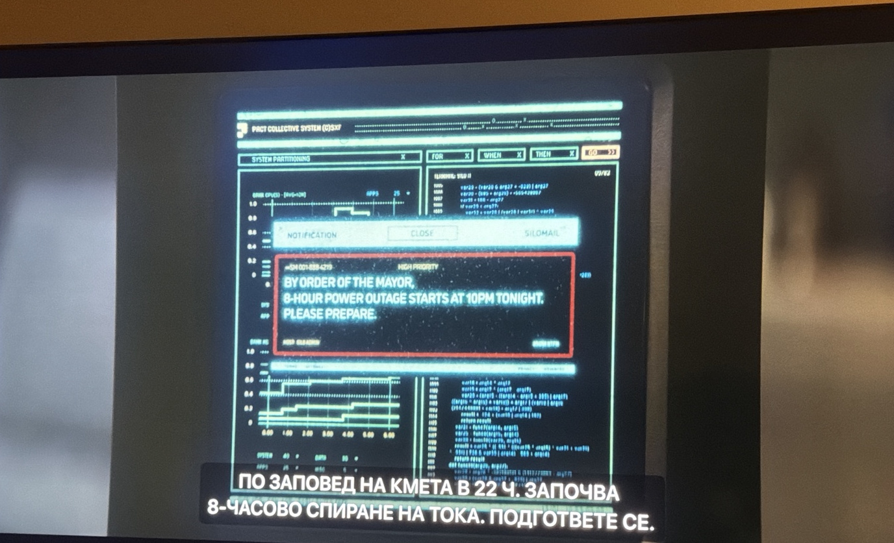

### Преки наблюдения

- има централизирана цифрова система за съобщения — `SILOMAIL`;
- кметицата може да нареди голямо планирано прекъсване на захранването;
- прозорецът на прекъсването е 8 часа;
- компютърните терминали са част от широка институционална мрежа, а не изолирани локални машини.

Това допълва наблюдението, че компютърни терминали се срещат широко на работни места в Силоза, включително в медицинска среда.

---

# 10. Енергийна архитектура — неизвестен източник на пара → турбина → генератор

S01E03 дава първия ясен технически модел на електрозахранването.

Основната наблюдавана верига е:

```text
НЕИЗВЕСТЕН ИЗТОЧНИК НА ПАРА ОТДОЛУ
                 │
                 ▼
              ТУРБИНА
                 │
                 ▼
             ГЕНЕРАТОР
                 │
                 ▼
       ЕЛЕКТРИЧЕСТВО ЗА СИЛОЗА
```

Персоналът на Mechanical твърди, че парата идва **от дълбините**, но никой не знае точно откъде.

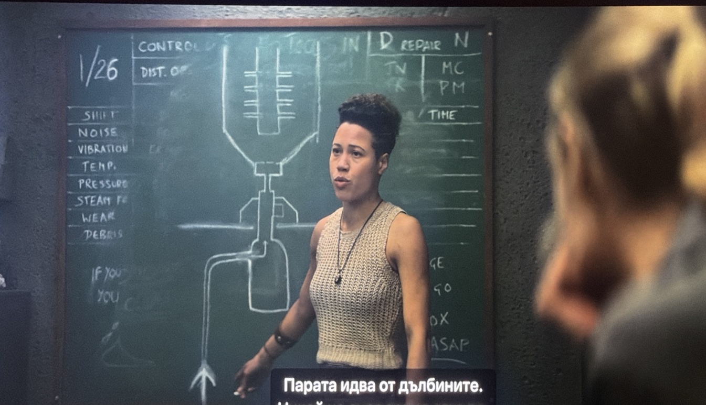

### Преки технически доказателства

- парата идва отдолу;
- влиза в турбинната система;
- турбината задвижва генератора;
- генераторната система произвежда електричество за Силоза.

### Свидетелство на персонаж

Текущият персонал на Mechanical не знае точния произход на основния източник на пара.

### Извод за системата

Mechanical поддържа **преобразуващата машинна част**, но не разбира напълно основния енергиен източник нагоре по веригата.

### Нова хипотеза

**H22 — Силозът зависи от наследена енергийна инфраструктура под Mechanical, която текущите оператори използват, без да я разбират напълно.**

**Увереност:** `H`

Не заключваме `геотермален`: това остава възможно обяснение, но не е установено.

---

# 11. Мащаб и ремонт на генератора

Турбинно-генераторният агрегат е огромна машина на множество нива.

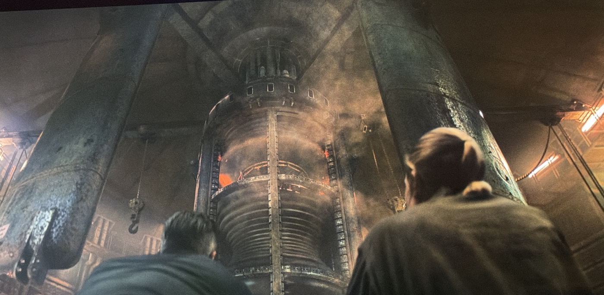

При поддръжка агрегатът се отваря и стават видими вътрешни секции на ротора/лопатките и обслужващи конструкции.

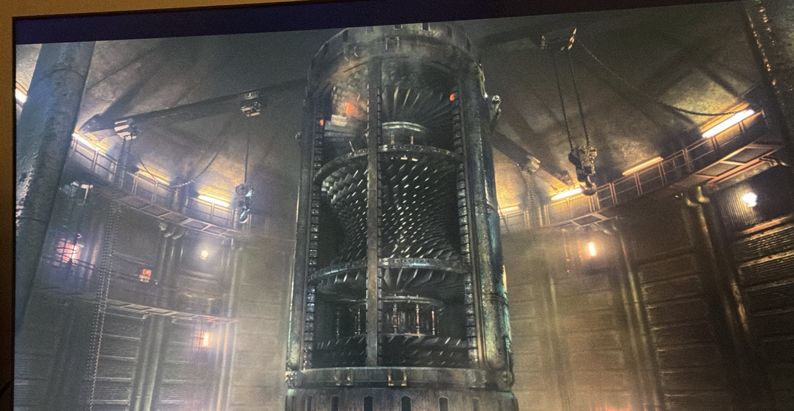

Това визуално потвърждава, че производството на електроенергия е основна централизирана зависимост от единна система за Силоза.

---

# 12. Силозът при прекъсване на захранването

По време на прекъсването нормалното осветление почти изчезва и хората разчитат на ограничени/локални светлинни източници.

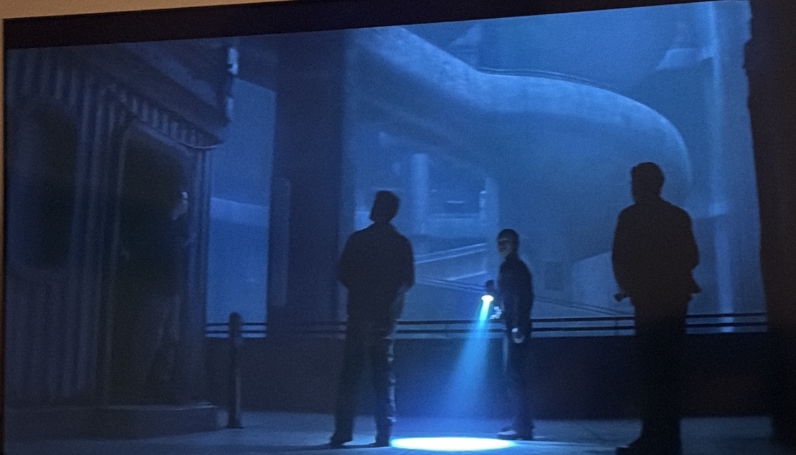

Това е контекст за света и инфраструктурата: вертикалното придвижване и ежедневната обитаемост са силно зависими от централизираното електрозахранване.

---

# 13. Критично доказателство — кратко зелено изображение на публичния екран при изключване

Това е най-силната данна от S01E03 за загадката на външната среда.

При изключване на публичния екран безплодното представяне на външната среда изчезва и за кратък момент екранът показва **зелено изображение на външната среда**.


### Какво доказва

- зеленото изображение съществува **в или е достъпно за визуалния канал на публичния екран**;
- публичният екран не е просто прозрачен директен монитор към един необработен поток от външна камера;
- публичният канал може да премине между поне две радикално различни визуални представяния/състояния на външната среда.

### Какво НЕ доказва

- че зеленото изображение е на живо;
- че зеленото изображение е реалната външна среда;
- че безплодното изображение е реалната външна среда;
- че краткото зелено изображение е поток от камера, наслагване, кеширан кадър, тестово изображение, резервно състояние или артефакт от кадровия буфер;
- че същият точен източник се използва в шлема при почистване.

### Движение на хипотезите

**H1 — визуалният информационен канал за външната среда се манипулира:** остава `VH`, но се **подсилва значително** с пряко доказателство от публичния екран.

**H3 — безплодният публичен изглед е по-близо до реалността, а зеленият изглед е наслагване/симулация:** остава `H`; краткото зелено изображение е съвместимо с тази теория, но не я доказва.

**Модел C — нито един поток не е напълно автентичен:** остава напълно жизнеспособен.

Тази данна трябва да се разглежда като доказателство за **множество налични визуални състояния**, а не като автоматично доказателство кое е реално.

---

# 14. Назначаването на Juliette и управленският конфликт

Holston вече е номинирал Juliette и е оставил значката си.

В S01E03 кметицата подкрепя/утвърждава Juliette като Sheriff въпреки противопоставянето от Bernard/IT.

Това превръща Juliette от външен за властовия център човек от долните нива в човек, който се движи към една от най-високите правоприлагащи позиции в горните нива.

### Социално значение

Това е силно прекрачване на регионалните/социалните граници, които епизодът едновременно показва чрез историята с баща ѝ.

---

# 15. Смъртта на кметицата

Епизодът завършва със смъртта на кметицата след привидно умишлена атака/отравяне.

### Пряко събитие

Кметицата умира при обстоятелства, представени като умишлено причинени, а не като естествена смърт.

### Какво не е установено

- кой е извършителят;
- кой е поръчителят;
- дали целта е била кметицата;
- дали мотивът е назначаването на Juliette;
- дали Bernard, Judicial, IT или друг участник е свързан.

### Нова хипотеза

**H21 — Убийството на кметицата е свързано с решението ѝ да назначи/подкрепи Juliette като Sheriff.**

**Увереност:** `M`

**Статус:** `Кандидат / Активна`

Подкрепящите доказателства към S01E03 са основно **времева близост + институционален конфликт + правдоподобен мотив**. Няма пряко доказателство за извършителя.

---

# 16. Движение на хипотезите след S01E03

| ID | Хипотеза | Преди | След | Причина |
|---|---|---:|---:|---|
| H1 | Визуалният канал за външната среда се манипулира | VH | VH | Зеленото изображение се появява директно на публичния екран при изключване. |
| H3 | Безплодният изглед е до голяма степен реален; зеленият е наслагване/симулация | H | H | Краткото зелено изображение при изключване е съвместимо, но не удостоверява безплодния изглед. |
| H13 | George е намерил долната врата | H | H | Juliette не проверява наводненото дъно; няма ново потвърждение. |
| H18 | Вертикалната архитектура създава социална сегрегация | — | H | Juliette и баща ѝ са практически разделени от почти 100 нива и времето за пътуване. |
| H19 | Законът срещу самоубийството пази колективния човешки ресурс/задължение | — | M | Самоубийството е сериозно престъпление срещу Силоза. |
| H20 | Неоторизираната комуникация се ограничава за контрол | — | M | Самоделното радио е строго забранено от Пакта. |
| H21 | Убийството на кметицата е свързано с назначаването на Juliette | — | M | Силна времева близост/мотив, без доказателство за извършител. |
| H22 | Енергийната система нагоре по веригата под Mechanical е наследена инфраструктура, която се разбира непълно | — | H | Източникът на пара идва отдолу и произходът му е неизвестен на операторите. |

---

# 17. Цели за наблюдение в S01E04

- кой е убил кметицата и какъв е мотивът;
- дали назначаването на Juliette остава в сила;
- реакциите на Bernard/IT и Judicial към новия Sheriff;
- дали краткото зелено изображение на публичния екран е забелязано от жителите или властите;
- техническо обяснение за двете състояния на изображенията на външната среда;
- произходът на източника на пара;
- пряко доказателство за долната врата;
- разследването на смъртта на George;
- действителният обхват на забраната за неоторизирано радио;
- последиците от правилото „самоубийството е престъпление“;
- точните граници на горните / средните / долните нива;
- дали социалната мобилност между регионите е нормална или изключение.

---

**Следваща граница на знанието:** `S01E04`
