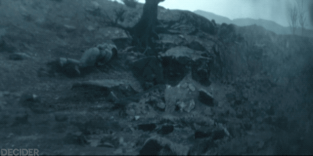

# S01E01 — Exterior Visual Contradiction

**Knowledge boundary:** `S01E01 only`

This note records the direct visual pair that defines the main exterior mystery after S01E01.

## A. Public display inside the Silo

The public display presents the exterior as gray, barren, and apparently lifeless.

### What this proves

- people inside are shown a barren exterior representation;
- the image includes the familiar tree / exterior landmark area;
- the public display is a concrete visual source, not merely a character description.

### What this does not prove

- that the public display is live;
- that the image is unprocessed;
- that the barren representation is the objectively real exterior;
- that the visible body / figure and landscape are being shown without manipulation.

---

## B. Jane Carmody cleaning recording

HDD #18 contains an older file labeled `JANE CARMODY CLEANING`. Its exterior representation is lush: green ground, blue sky, and a healthy-looking tree.

### What this proves

- lush exterior imagery existed in the cleaning system before Allison's cleaning;
- the lush representation is not unique to Allison's subjective experience;
- two incompatible visual representations of the same general exterior environment exist within Silo-controlled information systems.

### What this does not prove

- that Jane Carmody's image is live;
- that the lush representation is objectively real;
- that the recording is an unmodified camera feed rather than an overlay, simulation, or processed image.

---

## Comparison

| Source | Representation | Authentication status |
|---|---|---|
| Public Silo display | Gray / barren / dead-looking | Unauthenticated |
| Jane Carmody cleaning file | Green / blue / living-looking | Unauthenticated |
| Allison's cleaner helmet | Green / blue / living-looking | Unauthenticated |

The visual pair strengthens the episode-level conclusion:

> **The exterior visual-information pipeline cannot yet be trusted as a transparent representation of reality.**

It does **not** resolve which competing exterior model is correct.

## Effect on active hypotheses

- **H1 — exterior visual-information pipeline is deliberately manipulated:** remains `H`; now has direct archived visual evidence for both incompatible representations.
- **H2 — lush exterior is real:** no confidence change.
- **H3 — barren exterior is real / lush cleaner view is an overlay:** no confidence change.
- **Model C — neither feed is fully trustworthy:** remains a strong competing explanation.

The new screenshot strengthens the **evidence quality**, not one side of the exterior-truth dispute.