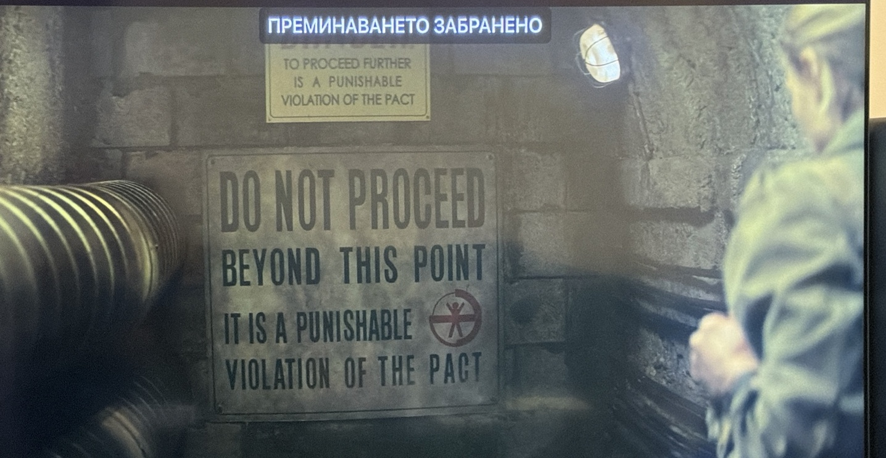
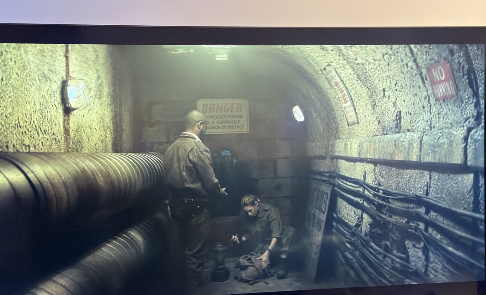
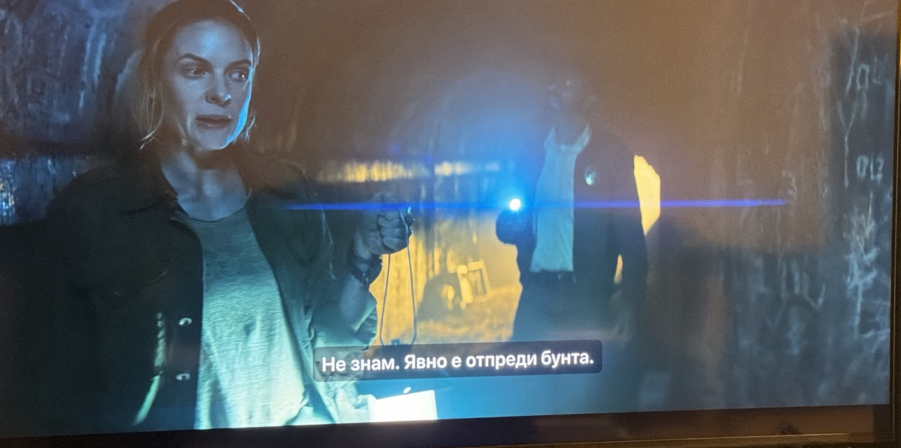
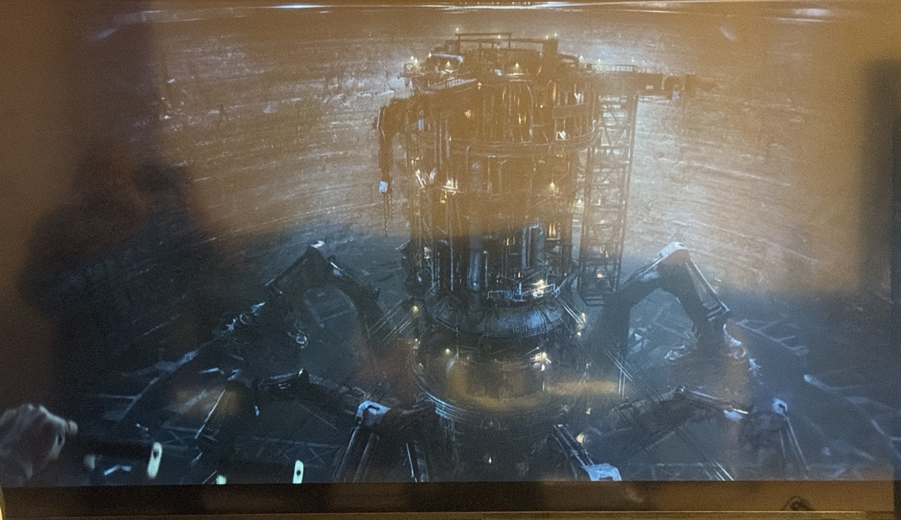
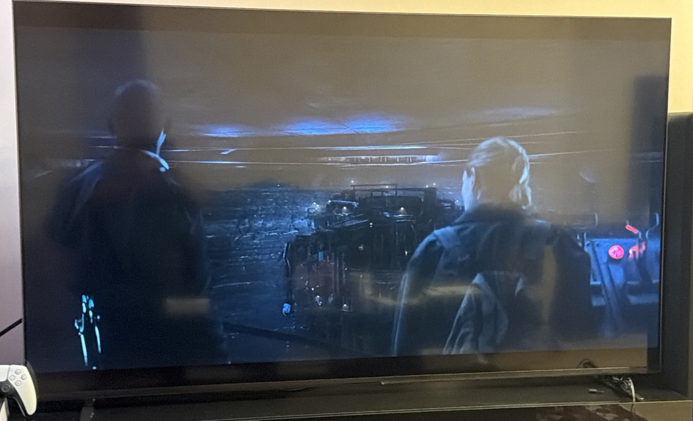
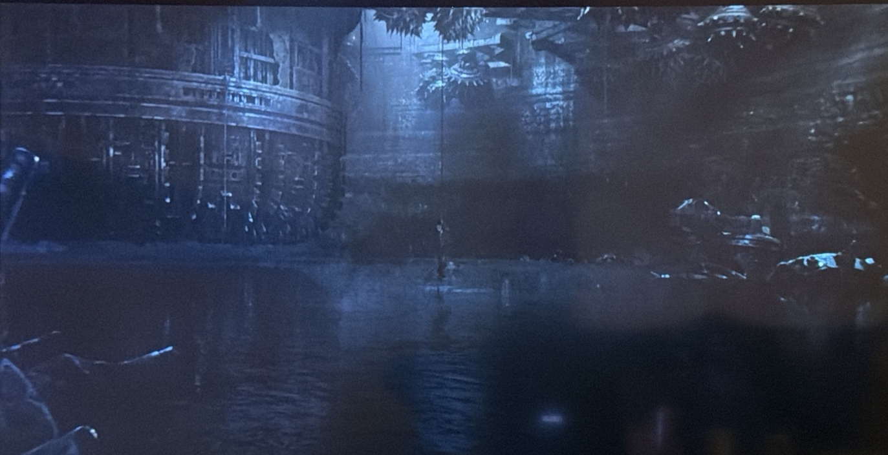

# S01E02 — Скрит строителен слой под Silo

**Knowledge boundary:** `S01E02 only`

Тази бележка събира architectural evidence-а, че познатият 144-level Silo не е физическият край на комплекса.

## Pact restriction

Достъпът до зоната е изрично забранен от Pact:



Това е `Direct visual evidence`, че restriction-ът е legal/institutional, а не просто техническа препоръка.

## Hidden opening и tunnel

Зад ограничението има нестандартен отвор, а не нормална обществена врата:



Juliette определя структурата като очевидно **pre-Rebellion**:



Pre-Rebellion origin-ът е `Character testimony`, не независимо датиране.

## Под structural bottom-а

От tunnel system-а има вертикален достъп надолу към голяма construction cavity под обитаемия Silo.

Там се намира масивна изоставена машина:



In-universe inference е, че това е машината, която е изкопала Силоза.

## Structural cap

Над машината се вижда масивен horizontal structural layer:



Персонажите теоретизират, че excavation machine е останала долу след строежа и construction cavity е била изолирана под дебел бетонен cap, описан приблизително като 9 m.

Screenshot-ът потвърждава structural boundary, но не потвърждава независимо точната дебелина или material composition.

## Flooded bottom

Най-ниската видима зона е широко наводнена:



Това е физическа бариера пред по-нататъшно изследване. Juliette има и личен страх от вода.

## George's door

George е търсил врата, видяна на рисунка, която според описанието е в края на short tunnel при дъното на тази construction zone. В оставеното съобщение той казва, че е **намерил това, което търси**.

Най-силният working model е:

> **George вероятно е локализирал вратата / входа към нея в или около flooded bottom под excavation machine.**

Това е `Strong inference`, не `Confirmed`.

## Връзка с HDD 18 blueprint-а

S01E01 показа `CLASSIFIED` lower tunnel в blueprint material-а от HDD 18.

S01E02 показва физически:

`Pact-restricted access`

→ `hidden opening`

→ `pre-Rebellion tunnel`

→ `sub-Silo construction cavity`

→ `excavation machine`

→ `flooded lower zone`

→ `reported door / short tunnel endpoint`

Тази структурна последователност силно подкрепя H12: физическият tunnel system вероятно е същата или пряко свързана структура с classified tunnel-а от HDD 18.

Все още липсва direct matching marker, който да потвърди identity на двете структури.

## Architectural model след S01E02

```text
UP-TOP / MIDS / DOWN-DEEP
        │
        │  144 inhabited levels
        ▼
OFFICIAL / STRUCTURAL BOTTOM
        │
        │  restricted / hidden access
        ▼
PRE-REBELLION TUNNEL SYSTEM
        │
        ▼
SEALED CONSTRUCTION CAVITY
        │
        ├─ excavation machine
        ├─ service platforms / lower machine levels
        └─ flooded lowest area
               │
               └─ reported short tunnel + door ?
```

## Заключение

> **Down-deep е социалното и обитаемо дъно на Силоза, но не и физическото дъно на комплекса.**

S01E02 установява скрит първоначален строителен слой под обитаемия Silo. Причината той да бъде юридически забранен и какво има зад описаната долна врата остават централни отворени въпроси.
