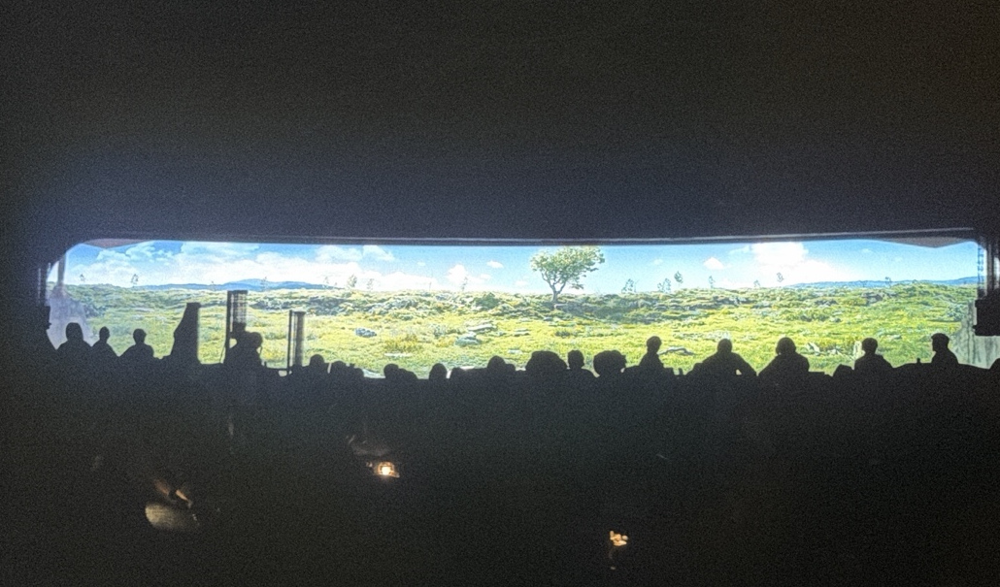

# S01E03 — Проблясък на публичния екран при спиране на захранването

**Knowledge boundary:** `S01E03 only`

Тази бележка изолира една от най-важните точки за системата на външните изображения до момента: при планирано изключване на захранването публичният екран за кратък момент показва зелено изображение на външната среда.

## Пряко наблюдение

Нормалното състояние на публичния екран е безплодна/сива външна среда.

При изключването на екрана картината за момент преминава към зелено представяне на външната среда.

## Какво доказва

- каналът на публичния екран има достъп до повече от едно визуално състояние на външната среда;
- зеленото изображение не е ограничено само до шлема на човека при почистване;
- публичният екран не може да се моделира като прост прозрачен монитор на един необработен източник;
- между физическия източник и показваното изображение вероятно има слой за обработка/състояние.

## Какво не доказва

- кое визуално състояние е реално;
- дали зеленото състояние е видеопоток на живо;
- дали безплодното състояние е видеопоток на живо;
- дали зеленото състояние е наслагване, кеширан кадър, резервно изображение, тестово изображение или друг артефакт;
- дали шлемът при почистване и публичният екран използват един и същ точен източник.

## Връзка с предишните доказателства

S01E01:

- public display: barren;
- Allison helmet: lush;
- Jane Carmody recording: lush.

S01E02:

- Holston helmet: lush;
- едновременно публичният екран показва безплодната среда.

S01E03:

- при изключването **самият публичен екран** за момент показва зелено изображение.

Така противоречието във външното изображение вече не е само конфликт между две устройства. Имаме доказателство, че **един и същ публичен краен визуален канал може да покаже радикално различни представяния на външната среда**.

## Въздействие върху хипотезите

### H1 — умишлено/манипулирано визуално представяне на външната среда

`VH → VH (Strengthened)`

Качеството на доказателството се увеличава значително.

### H3 — barren substantially real / lush overlay

Остава `H`.

Поведението при изключване е съвместимо с модел за наслагване/смяна на състояние, но не удостоверява безплодната външна среда като физическа реалност.

### Модел C — нито един поток не е напълно автентичен

Остава напълно жизнеспособен.

## Falsification targets

Следващите епизоди трябва да се следят за:

- системна диагностика / архитектура на екрана;
- означения на източниците или маршрутизирането;
- други артефакти при цикъл на захранване;
- реакцията на жителите/властите към зеления проблясък;
- дали зеленият кадър съвпада пиксел по пиксел с изображението при почистване или само тематично;
- независимо наблюдение на външната среда извън контролираните екрани.
